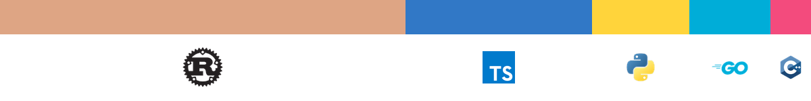

  

    
    
  

## 👨‍💻 About Me

**Hi! I'm Kevin, a software developer passionate about new technologies, focusing on Rust, Web3, and distributed computing.
I excel at building high-performance backend systems and am enthusiastic about exploring cutting-edge technologies.
Currently seeking opportunities in Rust/Web3/Cloud Computing, eager to bring my passion and skills to a new team 🚀**

#### Connect with me:

  

## 🛠️ Tech Stack

  <h4 style="margin-bottom: 5px;">Languages</h4>
  

    
    
    
    
    
  

  
  <h4 style="margin-bottom: 5px; margin-top: 8px;">Frameworks & Libraries</h4>
  

    
    
    
    
    
  

  
  <h4 style="margin-bottom: 5px; margin-top: 8px;">Cloud & DevOps</h4>
  

    
    
    
    
    
  

  
  <h4 style="margin-bottom: 5px; margin-top: 8px;">Databases</h4>
  

    
    
    
    
    
  

## ⏰ Programming Language Usage

  
  <!-- 使用生成的图片展示语言分布 -->
  

  <picture>
    <source media="(prefers-color-scheme: dark)" srcset="https://raw.githubusercontent.com/KevinZh0C/KevinZh0C/main/output/snake-dark.svg" />
    <source media="(prefers-color-scheme: light)" srcset="https://raw.githubusercontent.com/KevinZh0C/KevinZh0C/main/output/snake.svg" />
    
  </picture>

---

  

<h4>✨ Thanks for visiting! ✨</h4>

